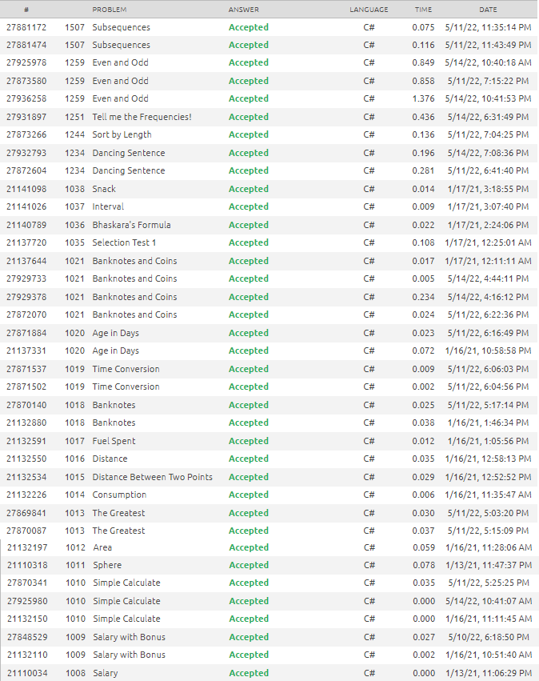

# Avaliação Sprint 2 – Programa de Bolsas

## Compass.UOL

## Estagiário: Dhiego Martins Andrade

---

### Notas Gerais

#### Os arquivos contendo as soluções para os problemas no Beecrowd seguem a seguinte nomeclatura:

**BEE_**{*número do problema*}**.cs**

### Submissões Beecrowd

Segue abaixo a lista de submissões aceitas feitas na plataforma Beecrowd:

